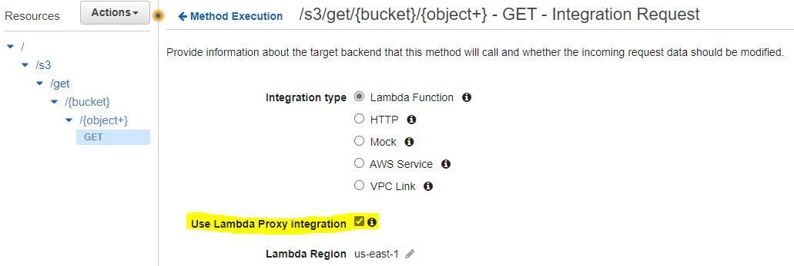

# S3 get object
This is an example of the _**s3 get object**_ lambda function.
The function gets object from incoming bucket and object names.

**Lambda Proxy integration** is used


The function responses on GET method:
```/s3/get/{bucket}/{object+-}```

Examples:
- ```/s3/get/my-bucket/file.txt``` 
- ```/s3/get/my-bucket/js/scripts.js```
## Requirements
Create Policy __S3GetObjectOnly__
```
{
    "Version": "2012-10-17",
    "Statement": [
        {
            "Sid": "VisualEditor0",
            "Effect": "Allow",
            "Action": [
                "s3:GetObject",
                "s3:ListBucket"
            ],
            "Resource": "*"
        }
    ]
}
```
and input the policy **Arn** in __template.yml__
```
...
# Function's execution role
Policies:
   - AWSLambdaBasicExecutionRole
   - arn:aws:iam::<Account ID>:policy/S3GetObjectOnly
...
```
## Deployment

gradle build
```
./gradlew build
```

Package
```
aws cloudformation package --template-file lambda/template.yml --s3-bucket dmitriy-zosimov-lambda --output-template-file package.yml
```
Deploy
```
aws cloudformation deploy --template-file package.yml --stack-name lambda-functions --region us-east-1 --capabilities CAPABILITY_NAMED_IAM
```

## Lambda-Proxy
Lambda proxy integration, that is used in this function, is a simple but powerful
integration. All the request to the APIGateway URL is forwarded **straight** to the Lambda and the response is sent
from Lambda, i. e. No modifications to the request(query params, body, variables) and response (query, params, body,
variables) and response (status code, message) are done by the API Gateway.
